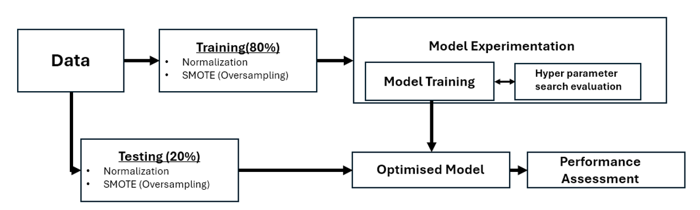
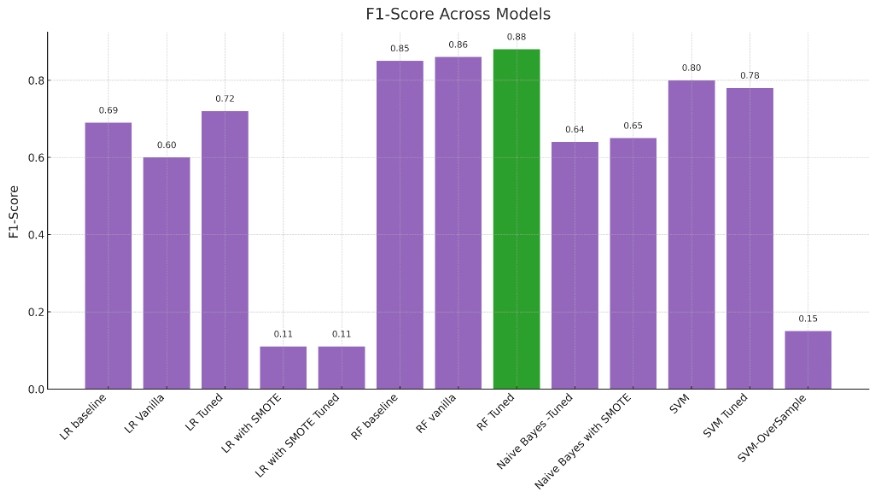

# Credit Card Fraud Detection

## **Introduction**
As online transactions increase, detecting fraudulent transactions has become crucial for financial security. Machine learning offers a robust solution by adapting to evolving tactics from scammers. This project aims to detect fraudulent credit card transactions using machine learning models and improve upon baseline results from a similar GitHub project.

---

## **Dataset**
- **Source**: [Kaggle Credit Card Fraud Detection Dataset](https://www.kaggle.com/datasets/mlg-ulb/creditcardfraud)
- **Summary**:
  - Total Transactions: 284,807
  - Fraudulent Transactions: 492 (0.172%)
  - Features: 28 PCA-transformed numerical features, `Time`, `Amount`, and a binary classification (`0` for normal, `1` for fraud`).

---

## **Data Preprocessing**
1. **Data Cleaning**: Duplicates and missing values were preprocessed.
2. **Feature Normalization**: Applied Min-Max Scaling to ensure consistent feature ranges.
3. **Handling Imbalanced Data**: 
   - **SMOTE** (Synthetic Minority Oversampling Technique) was used to oversample minority classes.
4. **Train-Test Split**: 
   - **80% Training** and **20% Testing**, maintaining class proportions.

---

## **Machine Learning Models**
### Models Trained:
1. **Logistic Regression** (Vanilla, Tuned, with SMOTE)
2. **Random Forests** (Vanilla, Tuned)
3. **Naive Bayes** (Vanilla, Tuned, with SMOTE)
4. **Support Vector Machines (SVM)** (Vanilla, Tuned, with SMOTE)

### Process Flow:
1. Data preprocessing and splitting.
2. Model training using GridSearchCV for hyperparameter tuning.
3. Model evaluation using F1-score, Precision, and Recall (Accuracy was excluded due to data imbalance).

---

## **Key Results**
| Model                  | Precision | Recall | F1-Score |
|------------------------|-----------|--------|----------|
| **LR Baseline**        | 0.8375    | 0.59   | 0.69     |
| **RF Tuned**           | 0.94      | 0.83   | **0.88** |
| **SVM Vanilla**        | 0.826     | 0.777  | 0.80     |
| **Naive Bayes Tuned**  | 0.79      | 0.54   | 0.64     |
| **LR Tuned**           | 0.83      | 0.64   | 0.72     |
| **SMOTE Variants**     | High Recall but Poor Precision (~0.11 F1-Score) |

### Observations:
- **Random Forests**: Achieved the highest F1-score of **88%**, outperforming the baseline by ~3%.
- **SVM**: Comparable F1-score to Random Forests with lower computational cost.
- **Logistic Regression**: Improved F1-score by ~3% over the baseline with hyperparameter tuning.
- **SMOTE Techniques**: Increased Recall but significantly reduced Precision, leading to poor F1 scores.

---

## **Challenges**
- **Imbalanced Data**: High data imbalance required careful preprocessing and evaluation.
- **Runtime**: Random Forest tuning required ~160 minutes due to model complexity.

---

## **Conclusion**
This project successfully improved baseline results in detecting fraudulent transactions:
- **Random Forests** performed the best with **88% F1-score**, demonstrating the importance of hyperparameter tuning.
- Future improvements should focus on:
  - **Explainability**: Enhance the interpretability of model predictions.
  - **Efficiency**: Reduce computational cost for large datasets.
  - **Balanced Metrics**: Address trade-offs between Precision and Recall for real-world applications.

---

## **Technologies Used**
- **Python**: Core programming language.
- **Scikit-Learn**: Model training and hyperparameter tuning.
- **Pandas/Numpy**: Data manipulation.
- **Matplotlib/Seaborn**: Data visualization.

